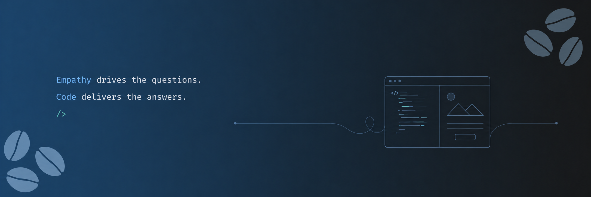

<div align="center">

<br/>

# Crystal Coral Dsouza

<p align="center">

[](https://git.io/typing-svg)

[](https://www.linkedin.com/in/crystalcoraldsouza/)
[](mailto:hello@crystalcoraldsouza.com)
[](https://www.crystalcoraldsouza.com)
[](https://github.com/crystalcoraldsouza)

</p>

### Welcome to my identity on the internet.

<p>
Journey through my little cosmos of interfaces, intelligent systems, creative experiments, and engineered chaos.
</p>
</div>

<br/>

```js
const crystal = {
  currently: "Building Interactive Experiences",
  specialisesIn: [
    "Frontend Architecture",
    "Adaptive Interfaces",
    "Context-Awareness",
    "Full-Stack Systems",
  ],
  energySource: "Caffeine",
};
```

<br/>

---

### Tech Stack & Tools

<p align="center">


</p>
